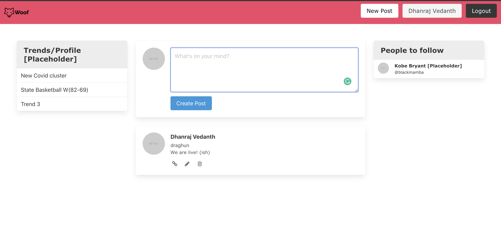

## Who are we?
- Woof is is an enterprise connectivity platform exclusive for NC State
- One stop solution to tackle remote education, collaboration and socialising with fellow NC State students, Professors and Clubs! 

## Why Woof? 
- COVID - 
- Single point to multiple resources 
- Why not! 
---

## Inspiration
- Inspired from Workplace that Facebook uses, one could discuss anything from a bug in a service to memes about Zuck there! 
- More about Workplace: https://tinyurl.com/y37nacqw 

## How can you contribute?

We welcome any and all contributions to the service and are excited to welcome you aboard. Any contributions you make to this effort **are of course greatly appreciated**.

Areas of focus: 
- Feature development [end-end chat, groups, trends, integration to name a few!]
- Rigerous testing 
- System design and database design

## Technical deets

- Webapp runs on Rails 6 
	- Thank to the beauty of gems, there's something for everything! 
- Mobile App runs on Java [Andriod]
---

> Current working webapp

Members: 
 - Vijay Anand
 - Ananya Nunna 
 - Sakshi Deshpande
 - Ayush Bisht
 - Dhanraj Raghunathan
